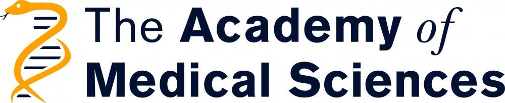
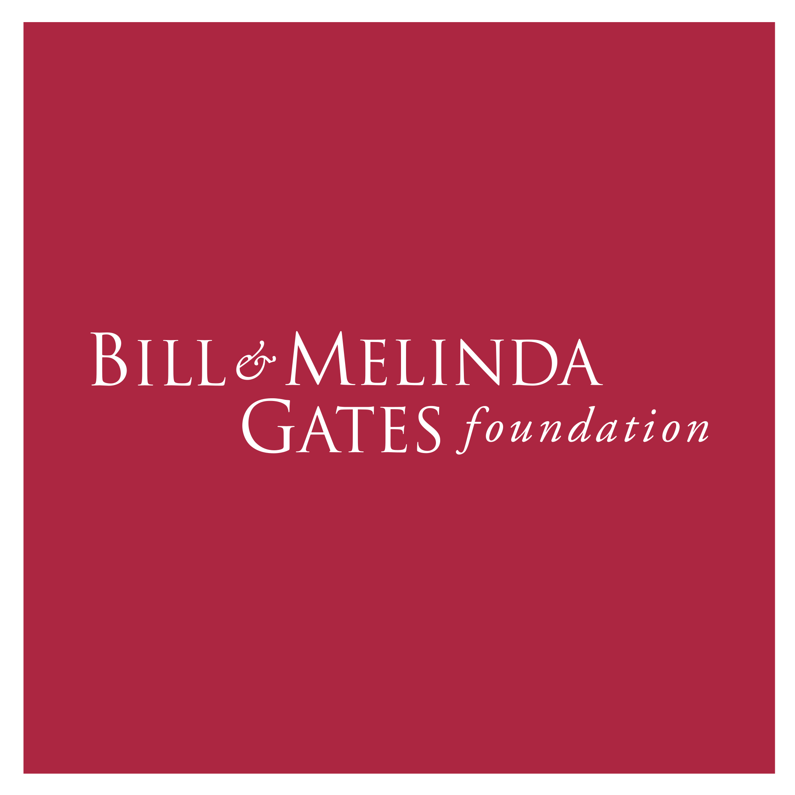
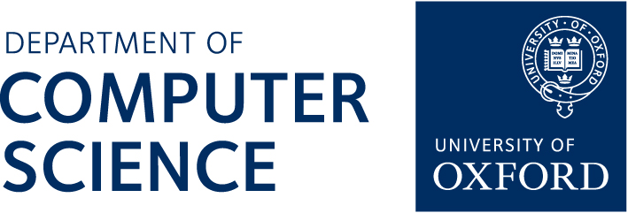

---
---

# Welcome to the Oxford Machine Learning in NeuroImaging Lab

### Department of Computer Science, University of Oxford

We are an interdisciplinary research group dedicated to advancing the understanding of early brain development through the integration of machine learning and neuroimaging. Our work focuses on developing data-efficient, scalable methods to extract clinically relevant information from ultrasound: the most widely used, and often only available, imaging modality in pregnancy care worldwide.

Our goal is to enable high-resolution, quantitative analysis of fetal brain development from routine clinical scans. By leveraging large-scale population datasets and collaborations across clinical and computational sciences, we aim to both improve scientific understanding of early brain maturation and develop practical tools for use in diverse healthcare settings.





Maybe the video here?



## Research areas

**Fetal Brain Maturation**
Modelling brain development trajectories from 14 weeks gestation using large-scale ultrasound datasets.

**Model Compression**
Creating lightweight neural networks for real-time analysis on portable devices.

**2D-to-3D Reconstruction**
Employing neural radiance fields (NeRFs) to generate volumetric brain images from standard 2D ultrasound videos.

**Federated Learning**
Training privacy-preserving models across multiple clinical sites without data sharing.

**Neurodevelopmental Outcomes**
Linking prenatal imaging features to postnatal cognitive and behavioral assessments.



## About us



Our Lab works on improving the diagnostics of the central nervous system by analysing and processing Ultrasound and MRI images of the brain. We are working on **Characterizing the Fetal Brain 2D-3D US Reconstruction Clinical Translation** and **Deep Learning Methodology**









We are a collaborative and open-minded group of people, eager to push the frontiers of biomedical imaging.









## News



### Tools and Resources

We are committed to open science. Many of our tools, pretrained models, and datasets are publicly available through our [GitHub](https://github.com/oxford-omni-lab) page, and we actively contribute to community efforts in medical imaging and AI.

### Joining the OMNI Lab

If you are interested in joining please go to the [recruitment](recruitment) page.



## Collaborators, Partners & Funding

Our work is supported by collaborations with the Nuffield Department of Women’s and Reproductive Health, the Wellcome Centre for Integrative Neuroimaging (WIN), and the Visual Geometry Group, among others.

We are grateful for funding from the University of Oxford [EPSRC Impact Acceleration scheme, and EPSRC Doctoral Prizes](https://www.ukri.org/councils/epsrc/), [Bill and Medlinda Gates Foundation](https://www.gatesfoundation.org/), the Academy of Medical Sciences [Springboard Awards scheme](https://acmedsci.ac.uk/), and the [Royal Academy of Engineering](https://raeng.org.uk/).

  
  
  
  


